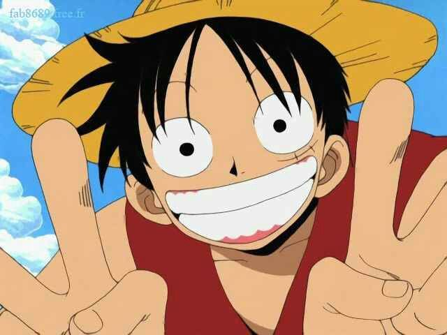

# Carlos A Guerra olivera
## Graduado en Náutica y Transporte Marítimo
* 1 Mi objetivo es aprobar el master y conseguir trabajo de profesor.
* 2 Me gusta leer.
* 3 No me gusta el desorden.


* [Acceso al perfil Alu0100703535](https://campusdoctoradoyposgrado2122.ull.es/user/profile.php?id=1177)
* [Acceso al perfil Git](https://github.com/CGuerra2021)

* Listado diario del masterisado:
1. Levantarse desayunar y hacer tareas.
2. Parar para almorzar y seguir haciendo tareas al acabar.
3. Parar de hacer tareas y poner rumbo a la facultad para que te ensen mas tareas aun.
4. Salir de clase modo zombie para hacer alguna otra tarea y repetir mañana lo mismo XD.

Como  decia Alejandro El grande:
* > Cuando damos a alguien nuestro tiempo, en realidad damos una parte de nuestra vida, que nunca vamos a recuperar.
* Inline code `<https://>`

* Codigo:   
```javascript
function fancyAlert(arg) {
  if(arg) {
    $.facebox({div:'#foo'})
  }
}
```
* Tabla:

| Tarea         | Practica    |
| ------------- | ----------- |
| Fichero       | Github      |
| Completada    | En proceso  |

* Emoji :shipit:

* [Accesomaster.md](https://github.com/CGuerra2021/master/blob/main/Master.md)

